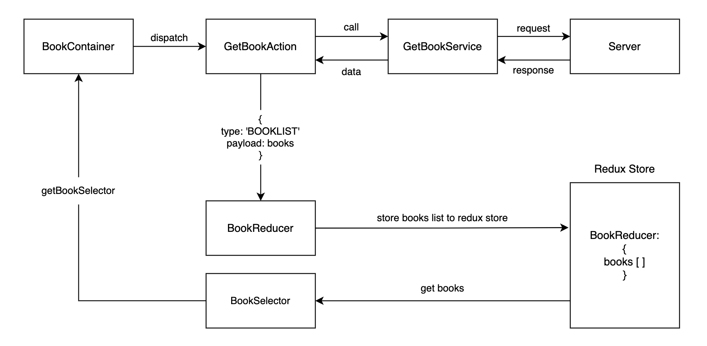

# Digital Book Journal
This is the frontend of a Java Full Stack Application built using React & Spring Boot. I was inspired to do this project as reading books is one of my hobbies and I wanted to create a digital book journal where I could keep track of all the books I have read. It was also an opportunity for me to learn new technologies such as SpringBoot and MongoDB which I have not used previously.

[Here](https://github.com/paulinakoz/book-store) is a link to the backend application for this project.
More information on the project can be found in the README of that application. 

## Built With 
* [![React][React.js]][React-url]
* 
* 
* 

## Quick Start 
```
# Clone this repository
git clone git@github.com:paulinakoz/book-store-client.git
cd book-store-client

# Install dependencies
npm install

# Run the build using
npm build

# Run tests using 
npm test 
npm test:nowatch
```
## User Stories
````
As a user,
To keep track of the books I read,
I want to be able to add them to the book journal

As a user, 
To check what books are in my book journal,
I want to be able to fetch all books

As a user,
To check if a specific book is already in the book journal,
I want to be able to search for the book by its title

As a user,
So that I have more information about the book, 
I want to see the author, description and release year

As a user,
To edit books already in the journal, 
I want to be able to update book details like the title, description or author

As a user, 
If I no longer want a book to be in the journal,
I want to be able to delete it from the list
````
## Application Architecture
* Spring boot on the backend
* React on the frontend
* MongoDB for the database
* Continuous integration using Travis CI

### Frontend Architecture



<!-- MARKDOWN LINKS & IMAGES -->
<!-- https://www.markdownguide.org/basic-syntax/#reference-style-links -->
[React.js]: https://img.shields.io/badge/React-20232A?style=for-the-badge&logo=react&logoColor=61DAFB
[React-url]: https://reactjs.org/